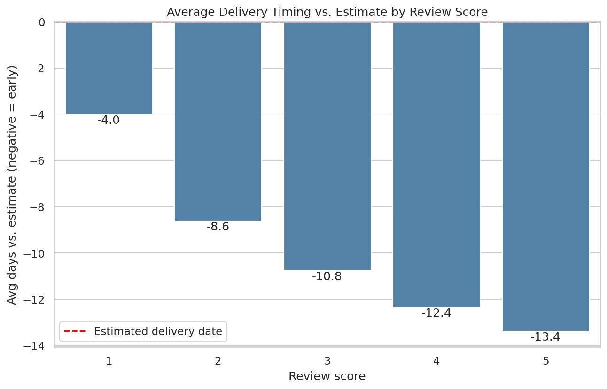
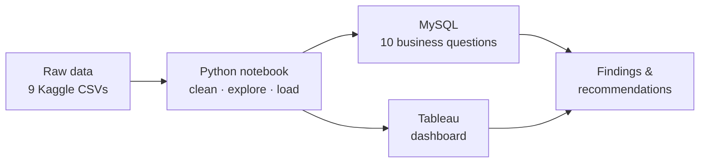

# Brazilian E-Commerce Analysis (Olist)

End-to-end analysis of **~100,000 orders** from Olist, Brazil's largest department-store marketplace (2016–2018), built with **Python, MySQL and Tableau**.

**Goal:** find what drives customer satisfaction, and where the revenue and operational levers are.

---

## Project Navigation

| Section | Description |
|---|---|
| [**Tableau Dashboard**](https://public.tableau.com/shared/26D5ZS9ZF?:display_count=n&:origin=viz_share_link) | Interactive dashboard on Tableau Public: monthly revenue trend, revenue by category and state, delivery vs. review score |
| [**Notebook**](notebooks/olist_eda_and_cleaning.ipynb) | Python: data cleaning, exploratory analysis, feature engineering, significance test and loading into MySQL |
| [**SQL Queries**](sql/olist_analysis_queries.sql) | MySQL: 10 business questions answered with joins and aggregations, with results in comments |
| [**Key Findings Report**](reports/key_findings.md) | Full write-up of results and business recommendations |
| [**Data**](data/README.md) | Dataset source and a summary of every change made to the raw data |
| [**Tableau Workbook**](dashboard/) | The `.twb` file and a guide to each dashboard sheet |
| [**Charts**](images/) | Charts used in this README and the report |

---

## Key Insights

| Insight | Evidence |
|---|---|
| **Delivery timing is closely tied to bad reviews.** 5★ orders arrive 13.4 days before the estimated date on average; 1★ orders arrive only 4.0 days before. | 27.58% of low-rated orders arrived late · Welch's t = −54.44, p < 0.0001 |
| **Delivery outside the Southeast is slow and expensive.** In Roraima and Paraíba, shipping averages \$43.09 (vs. \$15.11 in São Paulo) and delivery takes 20–28 days (vs. 8.2). | SQL Q5 |
| **Repeat customers are worth twice as much.** Only ~3% of customers return, but they spend **\$262 each vs. \$139** for one-time buyers. | SQL Q8 |
| **Price mix beats volume.** health_beauty earns the most revenue (\$1.26M) while selling fewer units than bed_bath_table, the volume leader. | SQL Q3 |
| **November 2017 (Black Friday) was the peak month**, with 7,421 orders and \$1.0M revenue. | SQL Q10 |
| **High volume ≠ high quality.** The busiest seller (1,834 orders) averages 3.91★; the top-rated seller (≥ 20 orders) has a perfect 5.0. | SQL Q4 |

  

## Recommendations

1. **Set realistic delivery estimates by region** and alert customers early when an order is at risk of arriving late.
2. **Improve logistics in northern and northeastern states**, where shipping costs up to 3× more and takes 2.4–3.4× longer than in São Paulo.
3. **Invest in retention**, with post-purchase campaigns timed before the November peak.
4. **Rate sellers on satisfaction as well as volume**, and share what top-rated sellers do well.

---

## How the Project Works

1. **Clean & explore (Python):** profiled all 9 tables, fixed data-quality issues, created delivery-time features and tested the delivery-vs-review gap for significance. The notebook ends by loading the cleaned tables into MySQL.
2. **Analyze (SQL):** answered 10 business questions using multi-table joins, `CASE`, subqueries, `HAVING` and date functions.
3. **Visualize (Tableau):** connected the cleaned tables in a relationship model centered on `order_details` and built the dashboard.

## Tools

Python (pandas, NumPy, SciPy, Matplotlib, seaborn) · MySQL · SQLAlchemy · Tableau Public · Jupyter

## Run It Yourself

1. Download the dataset into [`data/`](data/README.md).
2. `pip install -r requirements.txt`
3. Run the [notebook](notebooks/olist_eda_and_cleaning.ipynb) from top to bottom.
4. Run the [SQL queries](sql/olist_analysis_queries.sql) in MySQL Workbench (schema `Brazillian`).

---

*Monetary values are in Brazilian reais (R\$); "\$" is used as shorthand.*

**Author:** Faiz Alharthi · [GitHub](https://github.com/faiiz-33) · [Tableau Public](https://public.tableau.com/app/profile/faiz.alharthi4146)
